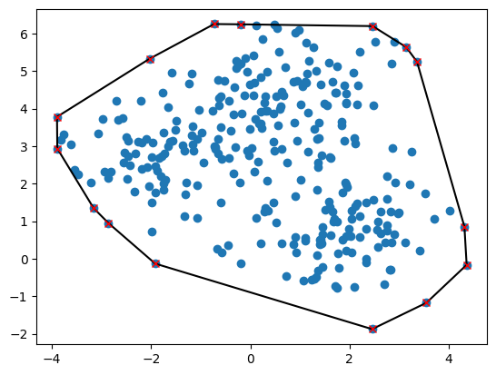

# Convex Hull

The calculation of the convex hull by the Graham scanning method is implemented. In addition to the python implementation, a C++ implementation is also presented here. To interact with the C++ code, `cppyy` is used.

To test the algorithm, the module is used `test.py`. Here the output of the implemented algorithm is compared with the result from the corresponding `ConvexHull` algorithm from `scipy.spatial`.

